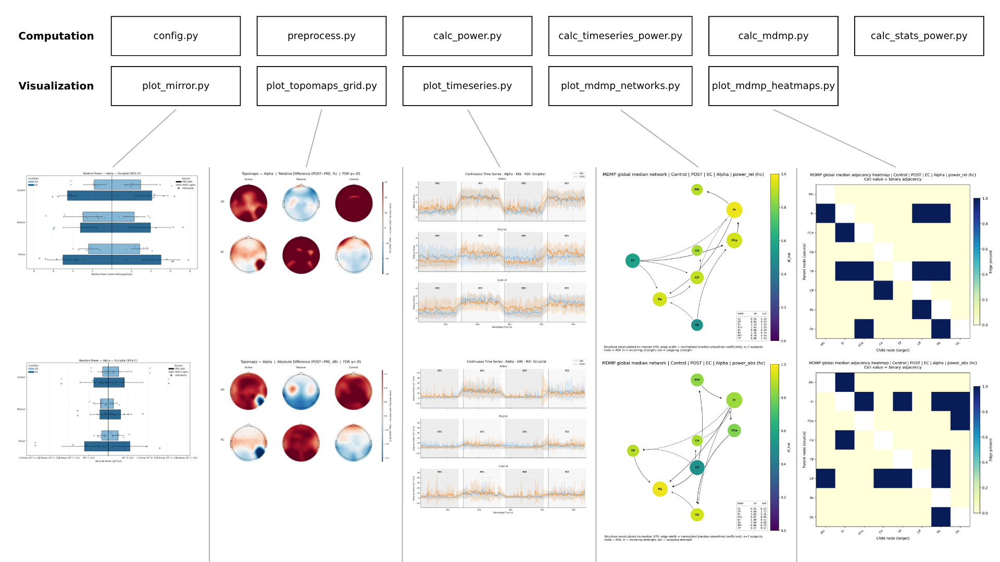
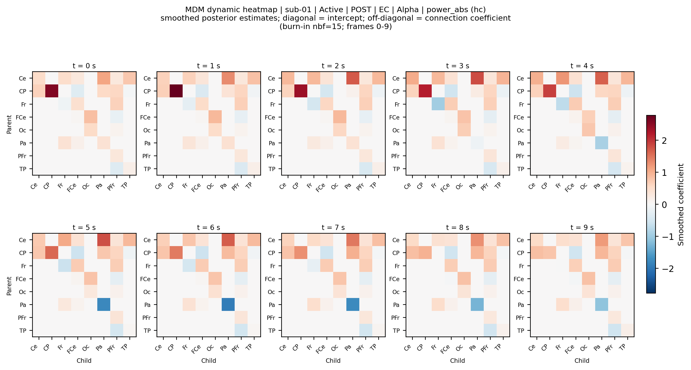
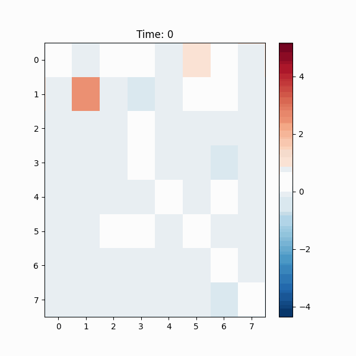

# Pyp-EEG

A complete pipeline to **preprocess**, **quantify**, and **visualize** EEG power in studies with **customizable** sessions and experimental conditions.
Inputs follow BIDS; outputs are publication-ready CSVs and figures.



---

## Repository layout

```
.
├─ code/
│  ├─ preprocess.py                         # BIDS-aware preprocessing for BrainVision
│  ├─ calc_power.py                         # builds wide power tables (ABS/REL)
│  ├─ calc_timeseries_power.py              # time-series data assembly
│  ├─ plot_timeseries.py                    # visualization: block-resolved time-series plots
│  ├─ plot_topomaps_grid.py                 # visualization: topographic grids
│  ├─ plot_mirror.py                        # visualization: mirror/bar/point plots
│  ├─ calc_stats_power.py                   # minimal paired stats from wide power tables
│  ├─ calc_mdmp.py                          # MDMP dynamic directed network inference
│  ├─ plot_mdmp_networks.py                 # MDMP network plots from calc_mdmp CSVs
│  ├─ plot_mdmp_heatmaps.py                 # MDMP static heatmaps + optional GIF/frame panels
│  └─ config.py                             # parameters and paths
├─ data/                                    # BIDS input
│  └─ sub-XX[/ses-YY]/eeg/*.vhdr + .eeg + .vmrk (+ .json)
├─ results/                                 # derivatives (generated)
│  ├─ processed/                            # preprocessed FIFs (concat, EO, EC, block1/block2 + manifest)
│  ├─ power/                                # power tables and ROI coverage
│  ├─ timeseries/                           # per-ROI×band temporal data
│  ├─ stats/                                # paired within-design stats
│  ├─ mdmp/                                 # group median and individual MDMP outputs
│  └─ plots/                                # figures and plot-side CSVs
├─ assets/
│  └─ steps.png
├─ run.py                                   # one-command pipeline orchestrator
├─ requirements.txt
└─ LICENSE.txt
```

> **Note**: `config.py` lives in `code/`. Scripts import it as `import config` when run from the project root (e.g., `python code/preprocess.py`).

---

## Installation

- **Python 3.9+** (3.12 recommended)
- From the **project root**, install pinned dependencies:

```bash
# (optional) create a virtual environment
python -m venv .venv
source .venv/bin/activate  # Windows: .venv\Scripts\activate

# install exact versions
pip install -r requirements.txt
```

> Using `requirements.txt` guarantees the versions used in the paper’s analyses.

---

## Data (BIDS)

**Expected input under `data/`:**
```
data/
├─ sub-01/
│  ├─ ses-pre/
│  │  └─ eeg/
│  │     ├─ sub-01_ses-pre_task-rest_eeg.vhdr
│  │     ├─ sub-01_ses-pre_task-rest_eeg.eeg
│  │     └─ sub-01_ses-pre_task-rest_eeg.vmrk
│  └─ ses-post/
│     └─ eeg/
│        └─ sub-01_ses-post_task-rest_eeg.vhdr ...
└─ sub-02/ ...
```

> Each `.vhdr` **must** correctly reference its `.eeg`/`.vmrk`.

---

## Dataset Used in This Project

This pipeline was developed and tested using the OpenNeuro dataset
[`ds006801`](https://doi.org/10.18112/openneuro.ds006801.v1.0.0).

- **OpenNeuro accession number**: `ds006801`
- **Dataset DOI**: [10.18112/openneuro.ds006801.v1.0.0](https://doi.org/10.18112/openneuro.ds006801.v1.0.0)
- **Modality**: EEG
- **Task**: `rest`
- **Sessions**: 2
- **Participants**: 21
- **License**: CC0
- **Dataset authors**: Paloma Victoria de Sales Alves, Antonio Simeão Sobrinho Neto, and Carla Alexandra da Silva Moita Minervino
- **Funding**: Coordination for the Improvement of Higher Education Personnel (CAPES) and the Federal University of Paraíba (UFPB)
- **Ethics approval**: CCS/UFPB Research Ethics Committee (CAAE `84958824.1.0000.5188`, approval `7.400.264`)

Recommended dataset citation:

> Paloma Victoria de Sales Alves, Antonio Simeão Sobrinho Neto, and Carla Alexandra da Silva Moita Minervino (2025). Resting-state EEG before and after different study methods. OpenNeuro. Dataset. doi:10.18112/openneuro.ds006801.v1.0.0

---

## Configuration (`code/config.py`)

`config.py` is inside `code/`. Because of that, `PROJECT_ROOT` should be the **parent of `code/`**:

```python
from pathlib import Path

SCRIPT_PATH   = Path(__file__).resolve()
PROJECT_ROOT  = SCRIPT_PATH.parent.parent      # <- repo root
DATA_DIR      = PROJECT_ROOT / "data"
RESULTS_DIR   = PROJECT_ROOT / "results"
PLOTS_DIR     = RESULTS_DIR / "plots"
POWER_DIR     = RESULTS_DIR / "power"
TS_DIR        = RESULTS_DIR / "timeseries"
PROCESSED_DIR = RESULTS_DIR / "processed"
```

Other key settings you will likely edit:

- **Filtering / PSD**
  ```python
  FILTER_LOW = 0.5
  FILTER_HIGH = 50.0
  NOTCH_HZ = 60        # (50 in EU)

  WELCH_SEG_SEC = 4.0
  WELCH_OVERLAP = 0.5
  PSD_FMIN      = 0.5
  PSD_FMAX      = 50.0
  ```

- **Blocks (EO/EC)** used for segmentation during preprocessing (seconds):
  ```python
  BLOCKS_WITH_STATE = [
      ("EO", (15, 135)),
      ("EC", (150, 270)),
      ("EO", (285, 405)),
      ("EC", (420, 540)),
  ]
  ```

- **Bands**
  ```python
  BANDS = {
      "Delta": (0.1, 3.5),
      "Theta": (4.0, 7.9),
      "Alpha": (8.0, 12.9),
      "Beta":  (13.0, 30.0),
      "Gamma": (30.1, 50.0),
  }
  ```
  In the current analysis, only `Alpha` is enabled by default in `config.py`.
  Users can enable or disable bands by commenting or uncommenting entries in `BANDS`.

- **Groups & ordering**
  ```python
  GROUP_ACTIVE  = {'01','05','07','10','15','16','19'}
  GROUP_PASSIVE = {'03','04','06','08','11','13','21'}
  GROUP_CONTROL = {'02','09','12','14','17','18','22'}

  GROUPS_ORDER = ["Active","Passive","Control"]
  VS_ORDER     = ["EO","EC"]       # visual states
  ```

- **ROIs** — used by the time-series plots (expose as `ROI_CHANNELS`):
  ```python
  REGIONS = {
      "Prefrontal":      ["Fp1","Fp2"],
      "Frontal":         ["F7","F3","Fz","F4","F8"],
      "Frontocentral":   ["FC5","FC1","FC2","FC6"],
      "Central":         ["C3","Cz","C4"],
      "Temporo-parietal":["FT9","T7","T8","FT10","TP9","TP10"],
      "Centro-parietal": ["CP5","CP1","CP2","CP6"],
      "Parietal":        ["P7","P3","Pz","P4","P8"],
      "Occipital":       ["O1","Oz","O2"],
  }
  ROI_CHANNELS = REGIONS
  ```

- **Time-series settings**
  ```python
  TS_WIN_SEC        = 4.0
  TS_STEP_SEC       = 1.0
  TS_FDR_ALPHA      = 0.05
  TS_MARK_SIG       = True
  TS_GENERATE_PLOTS = True

  # fixed X-windows in seconds
  TS_FIXED_X_WINDOWS = {
      "EO":   (0.0, 240.0),
      "EC":   (0.0, 240.0),
      "EO_1": (15.0, 135.0),
      "EC_1": (150.0, 270.0),
      "EO_2": (285.0, 405.0),
      "EC_2": (420.0, 540.0),
  }
  ```
  `EO` and `EC` refer to the concatenated state-level files (`*_EO_clean_raw.fif`,
  `*_EC_clean_raw.fif`) with time starting at `0 s`. `EO_1`, `EC_1`, `EO_2`, and
  `EC_2` are block-level windows in original recording time, used by `plot_timeseries.py`.

---

## Quick start (from project root)

### Run the full pipeline

To execute the full workflow with one command:

```bash
python3 run.py
```

Useful variants:

```bash
# run only the core analytical steps
python3 run.py --core-only

# keep core + MDMP, but skip topomaps and mirror plots
python3 run.py --skip-optional-plots

# keep core + optional plots, but skip MDMP products
python3 run.py --no-mdmp

# inspect available step keys
python3 run.py --list-steps

# preview commands without executing anything
python3 run.py --dry-run

# start from a specific step
python3 run.py --from-step timeseries_csv

# stop after a specific step
python3 run.py --to-step stats

# run only selected steps, in canonical order
python3 run.py --only mdmp,mdmp_networks,mdmp_heatmaps

# skip selected steps
python3 run.py --skip topomaps,mirror

# continue even if a step fails
python3 run.py --continue-on-error
```

What each variant does:

- `--core-only`: runs only `preprocess`, `power`, `timeseries_csv`, `timeseries`, and `stats`.
- `--skip-optional-plots`: removes `topomaps` and `mirror`, but keeps MDMP if it is otherwise enabled.
- `--no-mdmp`: removes `mdmp`, `mdmp_networks`, and `mdmp_heatmaps`.
- `--from-step <key>`: starts at the selected step and runs forward.
- `--to-step <key>`: stops after the selected step.
- `--only a,b,c`: runs only the listed step keys while preserving the pipeline's canonical order.
- `--skip a,b,c`: excludes only the listed step keys.
- `--continue-on-error`: continues with later steps instead of stopping on the first failure.
- `--dry-run`: prints the exact commands without executing them.
- `--list-steps`: prints all available step keys and exits.

1) **Preprocess** all `.vhdr` (BIDS-aware):
```bash
python code/preprocess.py
```

2) **Wide power tables** (ABS/REL):
```bash
python code/calc_power.py
```
Expected outputs:
```
results/power/
  power_long_by_region_EO_EC.xlsx
  power_wide_rel_EO_EC.csv
  power_wide_abs_EO_EC.csv
  roi_coverage_EO_EC.csv
```

3) **Time-series CSV for sliding-window analyses and MDMP:**
```bash
python code/calc_timeseries_power.py
```
Outputs:
```
results/timeseries/
  ts_power_long.csv
  readme_params.json
```

4) **Block-resolved time-series plots** (EO_1 / EC_1 / EO_2 / EC_2):
```bash
python code/plot_timeseries.py
```
Outputs:
```
results/plots/timeseries/
├─ csv/
│  └─ ts_all_bands_rois_relabs.csv
└─ figs/
   └─ ts_<Band>_<metric>_<ROI>.png
```

5) **Minimal paired stats** (EC vs EO, POST vs PRE) from wide tables:
```bash
python code/calc_stats_power.py
```
Outputs:
```
results/stats/
├─ rel/
│  ├─ stats_rel_EOvsEC.csv
│  └─ stats_rel_POSTvsPRE.csv
└─ abs/
   ├─ stats_abs_EOvsEC.csv
   └─ stats_abs_POSTvsPRE.csv
```

6) **Optional plots and MDMP derivatives:**
```bash
python code/plot_topomaps_grid.py
python code/plot_mirror.py

# MDMP inference from `results/timeseries/ts_power_long.csv`
python code/calc_mdmp.py

# MDMP heatmaps and network plots (run after `calc_mdmp.py`)
python code/plot_mdmp_heatmaps.py --input-dirs results/mdmp
python code/plot_mdmp_networks.py --input-dirs results/mdmp
```

---

## Detailed script descriptions

### `code/preprocess.py`
**Purpose:** BIDS-aware EEG preprocessing (BrainVision) and derivatives generation.
**Inputs:** `data/**/eeg/*.vhdr` (+ `.eeg`, `.vmrk`).
**Outputs:** `results/processed/**/eeg/`
- `*_desc-preproc_clean_raw.fif` (concatenated)
- `*_desc-preproc_EO_clean_raw.fif`
- `*_desc-preproc_EC_clean_raw.fif`
- `*_desc-preproc_EO_block1_raw.fif` (first EO block, post-ICA)
- `*_desc-preproc_EO_block2_raw.fif` (second EO block, post-ICA)
- `*_desc-preproc_EC_block1_raw.fif` (first EC block, post-ICA)
- `*_desc-preproc_EC_block2_raw.fif` (second EC block, post-ICA)
- `*_desc-preproc_blocks_manifest.csv`
**Key steps:** `standard_1020` montage, band-pass `[FILTER_LOW, FILTER_HIGH]`, notch `NOTCH_HZ`, average reference, EO/EC segmentation via `BLOCKS_WITH_STATE`, ICA (Infomax, `random_state=97`), automatic IC rejection with **ICLabel**, `visual_state:*` annotations.

---

### `code/calc_power.py`
**Purpose:** Compute **absolute (ABS)** and **relative (REL)** power per **Band × ROI** (EO/EC, PRE/POST).
**Inputs:** `results/processed/**/eeg/*_desc-preproc_(clean_raw|EO|EC)_clean_raw.fif`, `*_blocks_manifest.csv`.
**Outputs:** `results/power/`
- `power_long_by_region_EO_EC.xlsx`
- `power_wide_abs_EO_EC.csv`
- `power_wide_rel_EO_EC.csv`
- `roi_coverage_EO_EC.csv`
**Notes:** REL = band / total over [`PSD_FMIN`, `PSD_FMAX`]; deterministic ordering controlled by `config` lists.

### `code/calc_timeseries_power.py`
**Purpose:** Extract sliding-window power time series (ABS/REL) per **Band × ROI**.
**Inputs:** Preprocessed FIFs (`*_clean_raw.fif`) in `results/processed/**/eeg/`.
**Outputs:** `results/timeseries/`
- `ts_power_long.csv`
- `readme_params.json` (parameters used)
**Notes:** windows `TS_WIN_SEC` with step `TS_STEP_SEC`; Welch from `WELCH_SEG_SEC` and `WELCH_OVERLAP`; `t_sec` is normalized to each file's local time origin; robust filename parser for subject/session/state.

### `code/calc_stats_power.py`
**Purpose:** Minimal paired stats from wide power tables.
**Inputs:** `results/power/power_wide_{abs,rel}_EO_EC.csv`.
**Outputs:** `results/stats/{abs,rel}/`
- `stats_*_EOvsEC.csv`
- `stats_*_POSTvsPRE.csv`
**Key steps:** Computes Shapiro–Wilk on paired differences and enforces one global test family per table (conservative rule): if any panel violates normality (or is undefined), all rows use `wilcoxon`; otherwise all rows use paired `ttest_rel`. Reports means, Δ, p-values, significance stars, **Cohen’s d_z**, and `n`. Adds `delta_pct` with the correct baseline (EO for EC−EO; PRE for POST−PRE). Optional output precision via `PRECISION_MODE` (`none|fixed|auto`).

### `code/calc_mdmp.py`
**Purpose:** Build group-level median VTS and individual-subject MDMP networks from ROI time series (`ts_power_long.csv`).
**Inputs:** `results/timeseries/ts_power_long.csv`.
**Outputs:** group median VTS tables in `results/mdmp/groups/<metric>/` and individual-subject tables in `results/mdmp/individual/<metric>/`.

Each output directory contains:
- `mdmp_runs_summary.csv`
- `mdmp_edges_long.csv`
- `mdmp_delta_by_node.csv`
- `mdmp_skipped_runs.csv`

Median output directories also include:
- `mdmp_vts_metadata.csv`

**Notes:** by default, runs metrics listed in `config.MDMP_METRICS_TO_RUN`. For each metric it writes the median/group model under `config.MDMP_OUTPUT_DIR/groups/<metric>` (`results/mdmp/groups/power_rel`, `results/mdmp/groups/power_abs`) and the individual models under `config.MDMP_OUTPUT_DIR/individual/<metric>`. The median model groups by `config.MDMP_GLOBAL_GROUP_COLS`, aligns subject time series, computes `compute_vts(method="median")`, fits `MDM(...)`, and exports the final edge/node tables. Edge tables include `median_coef` and `abs_median_coef`, computed from the smoothed dynamic coefficient of each learned parent -> child connection.

### `code/plot_mdmp_networks.py`
**Purpose:** Plot directed MDMP graphs from already computed MDMP CSVs.
**Inputs:** one or more MDMP output directories containing `mdmp_edges_long.csv` and `mdmp_delta_by_node.csv`; `results/mdmp` is auto-expanded recursively to median and individual metric subdirectories.
**Outputs:** `results/plots/mdmp_networks/groups/<metric>/<band>/mdmp_median_<...>.png` for median VTS outputs, and `results/plots/mdmp_networks/individual/<metric>/<band>/mdmp_sub-<...>.png` when individual-run CSVs are provided.
**Notes:** node color = `df_hat`; edges use normalized `abs_median_coef`. This script no longer recalculates median VTS networks; `code/calc_mdmp.py` owns that computation.

---

### `code/plot_timeseries.py`
**Purpose:** Block-resolved time-series analysis for `EO_1`, `EC_1`, `EO_2`, and `EC_2`, with optional continuous and EO-combined views.
**Inputs:** `results/processed/**/eeg/*_desc-preproc_clean_raw.fif`.
**Outputs:** `results/plots/timeseries/`
- `csv/ts_all_bands_rois_relabs.csv`
- `figs/ts_<Band>_<metric>_<ROI>.png`
- `figs/ts_continuous_<Band>_<metric>_<ROI>.png` (optional)
- `figs/ts_eo_combined_<Band>_<metric>_<ROI>.png` (optional)
**Notes:** reconstructs block-level conditions from `visual_state:*` annotations, restores original recording-time coordinates, and applies optional BH-FDR timepoint marking (`TS_FDR_ALPHA`).

### `code/plot_topomaps_grid.py`
**Purpose:** 2×3 topographic grids (EO/EC × groups) of **POST − PRE** per band.
**Inputs:** Preprocessed FIFs.
**Outputs:** `results/plots/topomaps_grid_{rel,abs}/topogrid_{relDiff|absDiff}_<Band>.png`
**Notes:** per-channel one-sample t vs. 0 with **FDR q=.05**; REL shown as **Δ%**, ABS as **Δ dB**; shared color limits per figure.

### `code/plot_mirror.py`
**Purpose:** Mirror/bar/point plots for **Band × ROI**.
**Inputs:** `results/power/power_long_by_region_EO_EC.xlsx`.
**Outputs:**
- `results/plots/mirror_by_region_rel/mirror_<Band>_<ROI>.png`
- `results/plots/mirror_by_region_abs/mirror_<Band>_<ROI>.png`
**Notes:** PRE on left / POST on right; error bars = 95% CI (fallback: SE); outliers flagged when |z| ≥ 2; scientific notation on X-axis; per-panel X-limits (band+region).

### `code/plot_mdmp_heatmaps.py`
**Purpose:** MDMP adjacency heatmaps plus optional dynamic heatmap GIFs and static frame panels.
**Inputs:** one or more MDMP output directories containing `mdmp_edges_long.csv`, plus `results/timeseries/ts_power_long.csv` when dynamic GIFs/frames are enabled.
**Outputs:** `results/plots/mdmp_heatmaps/groups/<metric>/<band>/mdmp_heat_median_<...>.png` for median VTS outputs, `results/plots/mdmp_heatmaps/individual/<metric>/<band>/mdmp_heat_sub-<...>.png` when individual-run CSVs are provided, and, when enabled, `results/plots/mdmp_heatmaps/dynamic/<metric>/{gifs,frames}/<band>/...`.
**Notes:** configure dynamic outputs in `config.py`: `MDMP_HEATMAP_DYNAMIC_ENABLED` controls both GIFs and frame panels together; `MDMP_HEATMAP_FRAME_COUNT` and `MDMP_HEATMAP_FRAME_RANGE` control the frame panel (inclusive, e.g. `(0, 9)` renders seconds 0 through 9).

Static frame panels summarize selected dynamic coefficient matrices in a single PNG, while GIFs animate the same MDMP dynamics across time.



---




---

## Units & definitions

- **Absolute power (ABS)**: band-averaged PSD in **µV²/Hz** (`POWER_ABS_SCALE` in `config.py`, default `1e12`).
- **Relative power (REL)**: band / total power over `[PSD_FMIN, min(PSD_FMAX, Nyquist−1 Hz)]`.
- **Time-series**: windows of `TS_WIN_SEC` with step `TS_STEP_SEC`; Welch parameters from `WELCH_SEG_SEC` and `WELCH_OVERLAP`.

---

## Reproducibility notes

- Pin and report `python`, `mne`, and `mne-icalabel` versions (see `requirements.txt`).
- Keep `config.py` under version control; document any changes.
- Preserve `*_blocks_manifest.csv` for segmentation provenance.
- Fixed randomness: `ICA(..., random_state=97)`.

---

## Acknowledgments

This pipeline uses the `mdmp` ecosystem for dynamic network modeling in EEG analyses.

- **Original MDM/`mdmr` work**: [Lilia Costa](mailto:liliacosta@ufba.br)
- **`mdmr` R package maintainer**: [Arthur R. Azevedo](mailto:arthur.rios@ufba.br)
- **Python `mdmp` implementation used by this pipeline**: [Matheus Augusto Oliveira dos Santos](mailto:matheusaugusto@ufba.br)

---

## License

Licensed under **Creative Commons Attribution 4.0 International (CC BY 4.0)**.
See [`LICENSE.txt`](LICENSE.txt).

---

**Questions or issues?** [Open an issue](https://github.com/palomavictoriaalves/Pyp-EEG/issues/new)
 with the command you ran, your data layout (BIDS path), and the full error traceback.
If you prefer, you can also contact the maintainer by email: [palomavictoria14@gmail.com](mailto:palomavictoria14@gmail.com)
